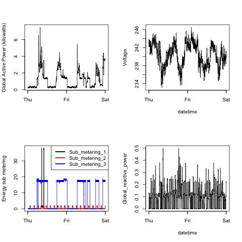

## Introduction

Hello peer. Thank you for taking the time to evaluate my project.

The result of my work can be found in the images below. Also you can check the R code in each of the files above,

### Plot 1

 

### Plot 2

 

### Plot 3

 

### Plot 4

 

